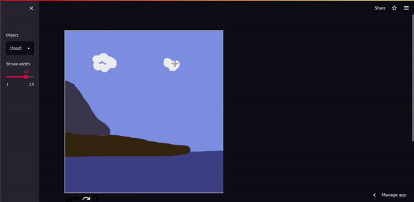
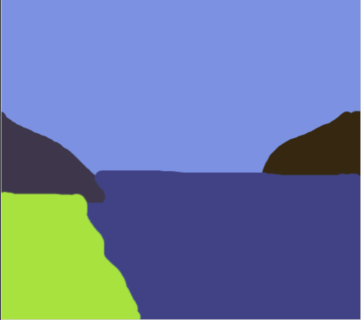
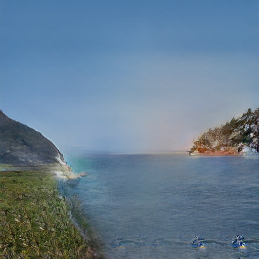
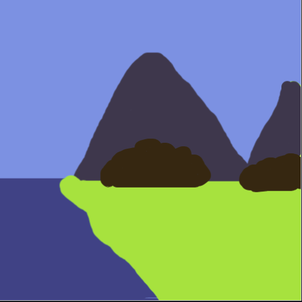
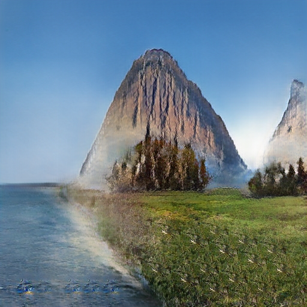

# Doodle-to-Image-Generator
This is an automatic realistic image generator from doodles using GauGan which has been deployed on streamlit. You can check it out [here](https://huggingface.co/spaces/Sheyz-max/doodle-to-image-generator).
This uses GauGAN to generate the images given the semantic maps or doodles here.
The model is based on Conditional GAN where given a particular image and a condition the realistic image gets generated.

The model has been taken from Nvidia labs SPADE released in 2019.
## Table of contents
* <a href="#Idea">Idea</a>
* <a href="#SampleResults">Sample Results</a>
* <a href="#Dataset">Dataset</a>
* <a href="#Setup">Setup</a>
* <a href="#Components">Different Components</a>
* <a href="#FineTuning">Fine Tuning the model</a>
* <a href="#ModelLoss">Model and Loss</a>
* <a href="#OtherExamples">Other Examples</a>
* <a href="#References">References</a>

<h2 id="Idea">Idea</h2>
A lot of interest was captured when GauGAN2 was released by Nvidia recently.
I wanted to check it out but turns out GauGAN2 has not yet been open-sourced to the public.
So, I started looking into GauGAN in general and found this implementation.
I wanted to fully understand the functioning of the model and understand how even though it was adopted from pix2pix model,
it still had way better results. Another factor was I wanted to make the front end easily accessible by the data science community
since not everyone is well versed with html and css. Hence, I deployed it on streamlit.

<h2 id="SampleResults">Sample Results</h2>
Here is the working of GauGAN in real life deployed on a website.

<h2 id="Dataset">Dataset</h2>
Originally in the SPADE paper, the model was trained on 3 different datasets namely COCO, cityscapes and  ADE20K. Although, Flcikr dataset was also used however I am not so sure about the segmentation
of that dataset. The model has been trained on 8 V100 GPUs that equals 128 GB of memory. So, to avoid any of such memory problems
I used a pretrained dataset. However, I tried training on custom dataset as well. You can find the details to that <a href="https://blog.paperspace.com/gaugan-training-on-custom-datasets">here</a>.

<h2 id="Setup">Setup</h2>

You can easily setup this application. Here are the steps to replicate my outcome in your system.

Clone the repository. <code>git clone https://github.com/Shreyz-max/Doodle-to-Image-Generator.git</code>

Create a conda environment. <code>conda create -n doodle_image python=3.10</code>

Activate environment. <code>conda activate doodle_image</code>

Install requirements file. <code>pip install -r requirements.txt</code>

Run app.py <code>streamlit run streamlit/app.py</code>

<h2 id="Components">Different Components</h2>
<code>app.py</code> has all of the streamlit code to run the frontend.

<code>label_colors.py</code> contains a list of dictionaries for each label as well as it's corresponding color that I have assigned
and its corresponding id in the coco dataset.

<h2 id="FineTuning">Fine Tuning the model</h2>

Here are a few things that I did.
So basically, GauGAN is trained to take a black and white semantic map and convert it into a realisitc image.
So, once we have a painted image, it is converted into black and white using its labels. I have selected a few labels from COCO
dataset. You have 182 labels. So, you can choose any of the labels. Just select a few labels from your choice from COCO dataset.
Change the color based on what you like in `label_colors.py`. Make sure that the ids of those labels match those of the COCO dataset.
Also make the changes in the select-box of `app.py` .
    In case you want to use a different model with different datasets. Download the model from here. Use `latest_net_G.pth` for this.

<h2 id="ModelLoss">Model and Loss</h2>
To understand the model and the different types of losses, I would suggest reading the paper here.
To train on your dataset, you can follow my repository here. This follows you through how to train in google colab. You can then download the model and load it in this project.
Make a few changes as mentioned above, and you will have a working frontend as well.

<h2 id="OtherExamples">Other Examples</h2>
Some other results to enjoy:
<h3 id="Performance">Performance of both algorithms on testing data</h3>
<table>
 <tr>
  <th>Doodle Input</th>
  <th>Realistic Image</th>
 </tr>
<tr>
 <td></td>
 <td></td>
 </tr>
<tr>
 <td></td>
 <td></td>
 </tr>
</table>

<h2 id="References">References</h2>

[Spade Paper](https://arxiv.org/pdf/1903.07291.pdf)

[Spade Implementation](https://github.com/NVlabs/SPADE/tree/master)

[Flask implementation](https://github.com/mcheng89/gaugan)
